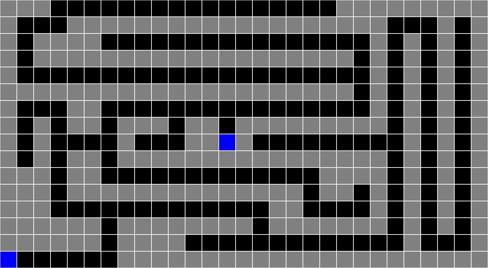
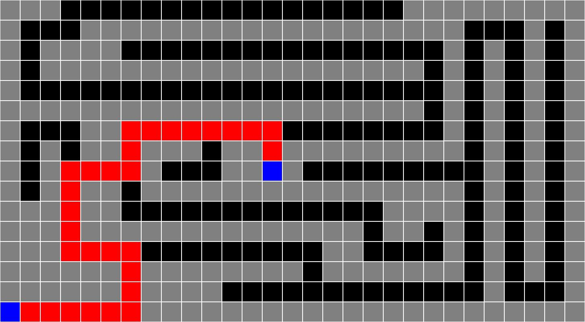

# MazeSolver

## Input

```text
###                 #########
#   ###################   # #
# ####                # # # #
# ################### # # # #
#                     # # # #
##################### # # # #
#   ##                # # # #
# # ## ### ## ######### # # #
# #    #   ##B#         # # #
# # ## ################ # # #
### ##             #### # # #
### ############## ## # # # #
###             ##    # # # #
###### ######## ####### # # #
###### ####             #   #
A      ######################
```

## Output

### Unsolved



### Solved


